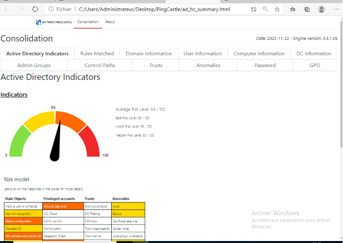
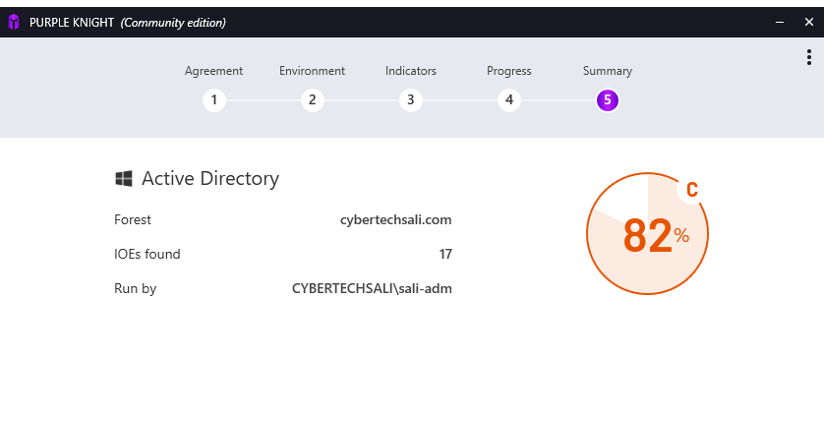
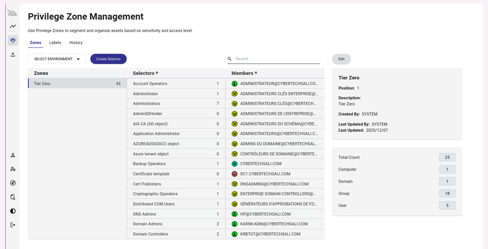
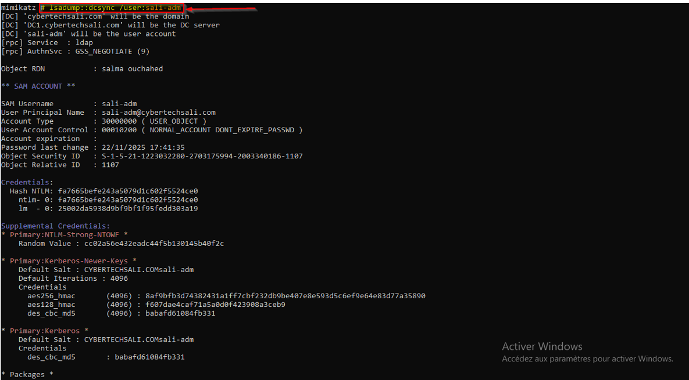
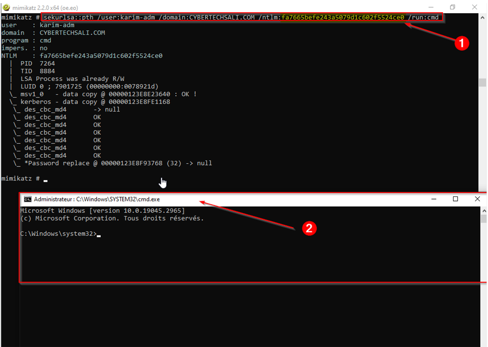
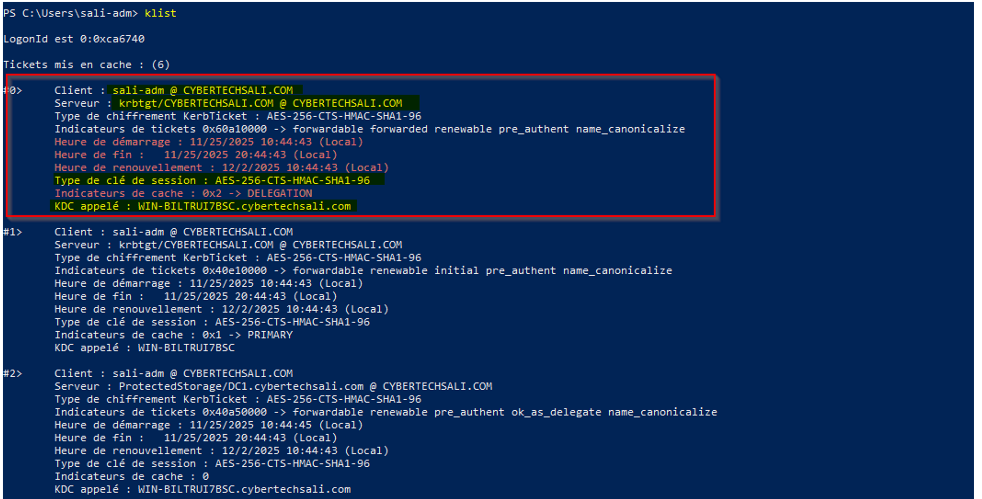
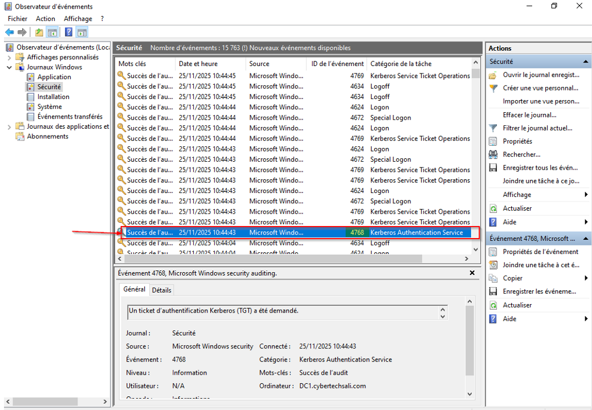
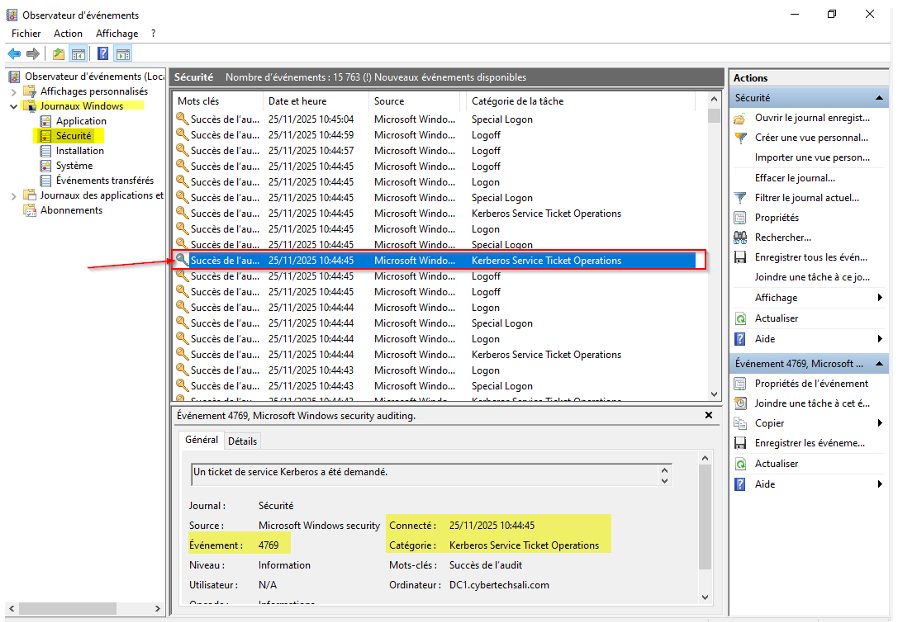

<p align="center">
  
  
  
  
</p>

<h1 align="center">🛡️ Active Directory Security Audit</h1>
<p align="center">
  <b>Domain :</b> cybertechsali.com &nbsp;|&nbsp; 
  <b>Period :</b> Nov – Dec 2025 &nbsp;|&nbsp; 
  <b>Author :</b> OUCHAHED SALMA
</p>

---

## Context

This project is a complete security audit of the `cybertechsali.com` Active Directory environment. The objective was to identify critical vulnerabilities, demonstrate their real-world impact through controlled exploitation, and propose a validated hardening roadmap.

---

## Tools Used

| Tool | Version | Purpose |
| :--- | :--- | :--- |
| **PingCastle** | 3.2.1 | Risk analysis and global scoring |
| **Purple Knight** | Community | Detection of exposure indicators (IOEs) |
| **BloodHound** | 8.3.1 | Attack path mapping and Tier 0 asset identification |
| **Mimikatz** | 2.2.0 | Credential extraction (DCSync, Pass-the-Hash, Pass-the-Ticket) |

---

## Key Findings

| Metric | Result |
| :--- | :--- |
| **PingCastle Score** | 55/100 (High Risk) |
| **Exposure Indicators (Purple Knight)** | 17 IOEs |
| **Tier 0 Assets Identified** | 25 objects (including 5 admin accounts) |
| **Demonstrated Compromise Time** | Less than 5 minutes |

---

## 📸 Visual Evidence (Screenshots)

| Finding | Screenshot |
| :--- | :--- |
| **PingCastle Score 55/100** |  |
| **17 IOEs Detected (Purple Knight)** |  |
| **BloodHound Attack Paths (Tier Zero)** |  |
| **DCSync Extraction (Mimikatz)** |  |
| **Successful Pass-the-Hash (Admin Shell)** |  |
| **Kerberos Ticket Validation (klist)** |  |
| **Event 4768 – TGT Request (Audit)** |  |
| **Event 4769 – TGS Request (Audit)** |  |

---

## Top 3 Exploited Vulnerabilities

1. **Print Spooler enabled on the DC** → DCSync attack (all domain hashes extracted).
2. **Admin accounts delegable** → Kerberos ticket theft (Pass-the-Ticket).
3. **NTLMv1/LM still active** → Pass-the-Hash (admin shell in 30 seconds).

---

## Remediation Roadmap

| Phase | Actions | Status |
| :--- | :--- | :--- |
| **Urgent (Week 1-2)** | Disable Spooler, rotate admin passwords, enable "sensitive & non-delegable" flag | ✅ Completed |
| **Structural (Week 3-8)** | Deploy LAPS, enable Credential Guard, add admins to Protected Users group | ⏳ In progress |
| **Governance (Month 2-6)** | Deploy SIEM, monitor Events 4768/4769, implement Tier 0/1/2 model | 📅 Planned |

---

## ✅ Hardening Validation – Before / After

| Before (Vulnerable) | After (Hardened) |
| :--- | :--- |
| `sekurlsa::pth /user:karim-adm /ntlm:fa7665bef... /run:cmd` <br> ✅ **Admin shell obtained** | `sekurlsa::pth /user:karim-adm /ntlm:fa7665bef... /run:cmd` <br> ❌ **Authentication failed – NTLM refused** |

---

### Post-Hardening Verification

**1. Kerberos Ticket Encryption (klist)**
The `klist` command confirms that all tickets are now issued with strong **AES-256-CTS-HMAC-SHA1-96** encryption.


**2. Security Auditing & Traceability (Event Viewer)**
To ensure detection capabilities are operational, the following critical security events are now successfully generated and logged on the Domain Controller:

- **Event ID 4768** : *Kerberos authentication ticket (TGT) was requested.*
  - *Purpose*: Detects initial authentication and TGT issuance.
  
  

- **Event ID 4769** : *A Kerberos service ticket (TGS) was requested.*
  - *Purpose*: Detects service access requests, crucial for identifying lateral movement (Pass-the-Ticket).
  
  

---

## Repository Structure

```text
Audit-AD-cybertechsali/
├── README.md
├── Rapport_Audit_AD_Final.pdf
├── Preuves/                          # 📸 Screenshot folder
│   ├── 01_PingCastle_Score55.png
│   ├── 02_PurpleKnight_IOEs.png
│   ├── 03_BloodHound_TierZero.png
│   ├── 04_Mimikatz_DCSync.png
│   ├── 05_PassTheHash_Shell.png
│   ├── 06_Remediation_Klist_Validation.png
│   ├── 07_Event4768_TGT.png          # 🆕 TGT Audit Log
│   └── 08_Event4769_TGS.png          # 🆕 TGS Audit Log
└── Scripts/
    ├── Disable_Spooler.ps1
    └── Apply_NTLM_Hardening.ps1
```

---

## Disclaimer

⚠️ **This project contains confidential information** (internal domain names, NTLM hashes, network topology).  
The repository is **private** and must not be shared publicly.  
Intended for lab use or advanced cybersecurity training purposes only.

---

## Author

**OUCHAHEd SALMA**  
*Cybersecurity Engineer – AD & Pentesting Specialist*  
[LinkedIn](https://www.linkedin.com/in/salma-ouchahed-652189206/) | [GitHub](https://github.com/CyberTechSali)

---

*Last updated: July 2026*
